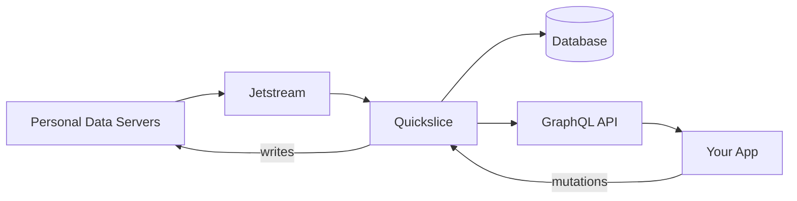
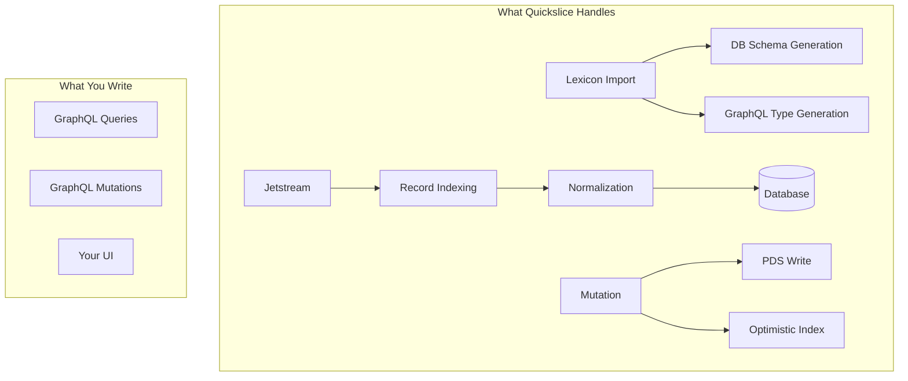
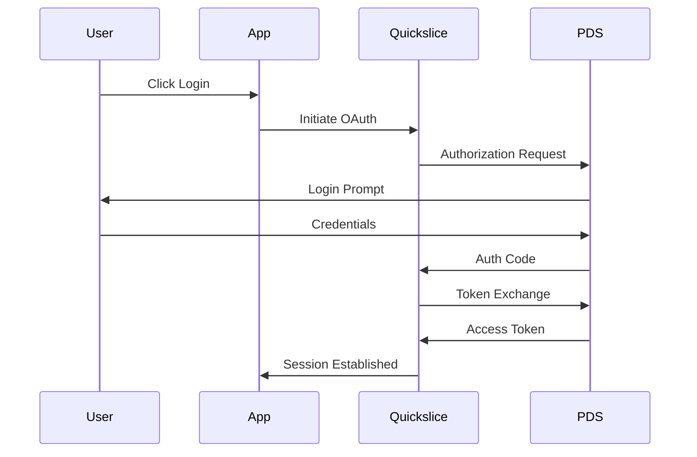
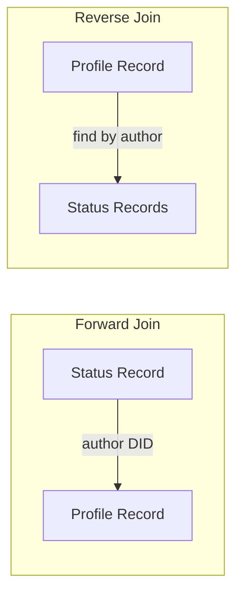

# Quickslice Documentation Redesign Implementation Plan

> **For Claude:** REQUIRED SUB-SKILL: Use superpowers:executing-plans to implement this plan task-by-task.

**Goal:** Rewrite quickslice docs with a tutorial-first, conversational style that helps AT Protocol developers understand quickslice is an AppView and what it does automatically.

**Architecture:** Tutorial-driven structure inspired by atproto.com's Statusphere guide. Side-by-side comparisons show "without quickslice" vs "with quickslice" to make the value proposition undeniable. Guides rewritten in conversational tone. Reference docs kept technical but clarified.

**Target Audience:** AT Protocol developers who already know DIDs, Lexicons, repos, OAuth, and the firehose.

**Key Message:** Quickslice gives you a production AppView with GraphQL, joins, and real-time sync - without writing resolver boilerplate, firehose ingestion, or database normalization code.

---

## Final Structure

```
docs/
├── README.md                 # What is Quickslice? (AppView mental model)
├── tutorial.md               # Build Statusphere with Quickslice (side-by-side)
├── guides/
│   ├── queries.md            # Querying data
│   ├── joins.md              # Forward, reverse, DID joins (killer feature)
│   ├── mutations.md          # Writing records
│   ├── authentication.md     # OAuth flow
│   ├── deployment.md         # Going to production
│   ├── troubleshooting.md    # Common issues and solutions
│   └── patterns.md           # Common patterns and recipes
└── reference/
    ├── aggregations.md
    ├── subscriptions.md
    ├── blobs.md
    ├── variables.md
    └── mcp.md
```

## Diagrams

Use Mermaid diagrams throughout the docs for:
- **README.md**: High-level architecture (PDS → Jetstream → Quickslice → Your App)
- **tutorial.md**: Data flow diagram showing what quickslice handles
- **guides/authentication.md**: OAuth flow diagram
- **guides/joins.md**: Visual showing forward vs reverse joins

---

## Writing Style Guidelines

Apply these to all documentation:

1. **Conversational but not casual** - "We're going to..." not "Let's dive in!"
2. **Direct and confident** - State what things are, not what they "can be"
3. **Show, don't tell** - Code examples over descriptions
4. **Explain the why** - Brief context before the how
5. **Active voice** - "Quickslice indexes records" not "Records are indexed"
6. **No jargon without context** - Define or link terms on first use

---

## Task 1: Create Directory Structure

**Files:**
- Create: `docs/guides/` (directory)
- Create: `docs/reference/` (directory)

**Step 1: Create directories**

```bash
mkdir -p docs/guides docs/reference
```

**Step 2: Commit**

```bash
git add docs/guides docs/reference
git commit -m "docs: create guides and reference directory structure"
```

---

## Task 2: Write README.md (AppView Mental Model)

**Files:**
- Rewrite: `docs/README.md`

**Step 1: Write the new README**

The README should be ~300 words and cover:

1. **Opening hook** (2-3 sentences):
   - Quickslice is an AppView
   - Point it at Lexicons, get GraphQL API with OAuth, real-time sync, joins

2. **The problem it solves** (bullet list):
   What you'd normally build manually:
   - Jetstream connection and event handling
   - Record ingestion and validation
   - Database schema and normalization
   - GraphQL resolver code
   - OAuth handling and PDS writes

3. **What quickslice does automatically** (bullet list):
   - Connects to Jetstream and tracks your Lexicon record types
   - Indexes records into a normalized database
   - Generates GraphQL queries, mutations, and subscriptions
   - Handles OAuth and writes to the user's PDS
   - Enables joins by DID, URI, or strong ref

4. **When to use it** (1 sentence):
   - Building any app that aggregates and queries AT Protocol data

5. **Next step**:
   - Link to tutorial

**Reference for tone:** Read `/Users/chadmiller/code/atproto-website/src/app/[locale]/guides/overview/en.mdx` for conversational style.

**Step 2: Review and refine**

Read aloud. Does it sound like a person explaining to a colleague? Remove any marketing fluff.

**Step 3: Commit**

```bash
git add docs/README.md
git commit -m "docs: rewrite README with AppView mental model"
```

---

## Task 3: Write tutorial.md (Statusphere with Side-by-Side Comparisons)

**Files:**
- Create: `docs/tutorial.md`
- Reference: `examples/01-statusphere/` (existing example code)
- Reference: `/Users/chadmiller/code/atproto-website/src/app/[locale]/guides/applications/en.mdx` (for comparison content)

**Step 1: Write the tutorial intro**

Opening (~100 words):
- We're building Statusphere - users share status as emoji
- Same app from AT Protocol docs, but using Quickslice as AppView
- Along the way, show what you'd write manually vs what quickslice handles

**Step 2: Write Step 1 - Project Setup & Importing Lexicons**

Content:
- Show the Lexicon file (`xyz.statusphere.status`)
- Explain what happens automatically when you import it:
  - Registers collection for Jetstream tracking
  - Creates normalized database schema
  - Generates GraphQL types

Side-by-side comparison box:

```markdown
| WITHOUT QUICKSLICE | WITH QUICKSLICE |
|---|---|
| Write Firehose connection code | Import your Lexicon: |
| Filter for your collection | `lexicons/xyz.statusphere.status.json` |
| Validate incoming records | |
| Design database schema | Quickslice handles the rest. |
| Write ingestion logic | |
| (~50-100 lines) | |
```

**Step 3: Write Step 2 - Querying Status Records**

Content:
- Show a GraphQL query for statuses
- Explain Relay-style connections (edges/nodes)
- Show filtering and sorting

Side-by-side comparison:

```markdown
| WITHOUT QUICKSLICE | WITH QUICKSLICE |
|---|---|
| Write GraphQL schema | Query is auto-generated: |
| Write resolver functions | |
| Handle pagination logic | `query { xyzStatusphereStatus { edges { node { status } } } }` |
| Build SQL queries | |
| (~100+ lines) | |
```

**Step 4: Write Step 3 - Joining Profile Data (The "Aha" Moment)**

This is the killer feature section. Content:
- Show joining `app.bsky.actor.profile` to get display names
- Explain forward joins (following a DID reference)
- Explain how quickslice normalizes records to enable this
- Mention DataLoader pattern used internally

Side-by-side comparison:

```markdown
| WITHOUT QUICKSLICE | WITH QUICKSLICE |
|---|---|
| Collect DIDs from status records | Add join to your query: |
| Batch resolve DIDs to profiles | |
| Handle N+1 query problem | `statusAuthor { appBskyActorProfile { displayName } }` |
| Write DataLoader implementation | |
| Join data in resolver | |
| (~150+ lines) | |
```

**Step 5: Write Step 4 - Writing a Status (Mutations)**

Content:
- Show mutation GraphQL
- Explain what happens:
  - Writes to user's PDS
  - Optimistically indexes record locally
  - OAuth handled automatically

Side-by-side comparison:

```markdown
| WITHOUT QUICKSLICE | WITH QUICKSLICE |
|---|---|
| Get OAuth session/agent | Call the mutation: |
| Construct record with $type | |
| Call putRecord on PDS | `mutation { createXyzStatusphereStatus(input: { status: "👍" }) { uri } }` |
| Optimistically update local DB | |
| Handle errors | |
| (~50+ lines) | |
```

**Step 6: Write Step 5 - Authentication**

Brief section:
- OAuth redirect flow
- Session handling
- How authenticated requests work with quickslice

**Step 7: Write Step 6 - Deploying to Railway**

Streamlined deployment:
- Keep essential steps from existing `quickstart.md`
- Remove unnecessary detail
- Link to `guides/deployment.md` for advanced options

**Step 8: Write Closing - "What You Didn't Write"**

Summary box listing all boilerplate quickslice handled:
- Jetstream connection and filtering
- Record validation
- Database schema and migrations
- GraphQL schema and resolvers
- DataLoader for joins
- Optimistic updates
- OAuth session management

**Step 9: Review the full tutorial**

Read through as if you're an atproto developer seeing this for the first time. Is the value proposition clear? Are the side-by-side comparisons compelling?

**Step 10: Commit**

```bash
git add docs/tutorial.md
git commit -m "docs: add Statusphere tutorial with side-by-side comparisons"
```

---

## Task 4: Write guides/joins.md (Killer Feature Guide)

**Files:**
- Create: `docs/guides/joins.md`
- Reference: `docs/joins.md` (existing content to extract from)

**Step 1: Write the joins guide**

Structure:
1. **Why joins matter** (~50 words)
   - The network has distributed data
   - Joins bring it together without manual resolution

2. **Forward joins** (~100 words + example)
   - Following a DID/URI reference to another record
   - Example: Getting profile from status author

3. **Reverse joins** (~100 words + example)
   - Finding all records that reference a given record
   - Example: Finding all statuses by a user

4. **DID joins** (~100 words + example)
   - Joining by author identity
   - Example: Joining any record type by its author's DID

5. **Strong ref joins** (~50 words + example)
   - Joining by exact record reference (collection + rkey)

6. **Common patterns** (~100 words)
   - Profile lookups
   - Follow relationships
   - Like/repost counts

**Reference for existing content:** Read `docs/joins.md` and extract the good examples, rewrite in conversational style.

**Step 2: Commit**

```bash
git add docs/guides/joins.md
git commit -m "docs: add joins guide as killer feature documentation"
```

---

## Task 5: Write guides/queries.md

**Files:**
- Create: `docs/guides/queries.md`
- Reference: `docs/queries.md` (existing content)

**Step 1: Write the queries guide**

Structure:
1. **Relay connections** - edges/nodes pattern, why it exists
2. **Filtering** - where clauses, operators (eq, contains, gt, lt, etc.)
3. **Sorting** - single and multi-field sorting
4. **Pagination** - cursor-based, first/after/last/before

Rewrite existing content from `docs/queries.md` in conversational style. Keep all the good examples.

**Step 2: Commit**

```bash
git add docs/guides/queries.md
git commit -m "docs: add queries guide"
```

---

## Task 6: Write guides/mutations.md

**Files:**
- Create: `docs/guides/mutations.md`
- Reference: `docs/mutations.md` (existing content)

**Step 1: Write the mutations guide**

Structure:
1. **Creating records** - with example
2. **Updating records** - with example
3. **Deleting records** - with example
4. **Optimistic indexing** - what happens behind the scenes
5. **Error handling** - common errors and how to handle

Rewrite from `docs/mutations.md` in conversational style.

**Step 2: Commit**

```bash
git add docs/guides/mutations.md
git commit -m "docs: add mutations guide"
```

---

## Task 7: Write guides/authentication.md

**Files:**
- Create: `docs/guides/authentication.md`
- Reference: `docs/authentication.md` and `docs/building-apps.md` (existing content)

**Step 1: Write the authentication guide**

Structure:
1. **OAuth flow overview** - how it works with quickslice
2. **Setting up OAuth** - signing key, client metadata
3. **Login/logout flow** - redirect, callback, session
4. **Authenticated queries** - how auth context is passed
5. **Public vs authenticated** - when auth is required

Combine and rewrite from `docs/authentication.md` and `docs/building-apps.md`.

**Step 2: Commit**

```bash
git add docs/guides/authentication.md
git commit -m "docs: add authentication guide"
```

---

## Task 8: Write guides/deployment.md

**Files:**
- Create: `docs/guides/deployment.md`
- Reference: `docs/deployment.md` and `docs/quickstart.md` (existing content)

**Step 1: Write the deployment guide**

Structure:
1. **Railway** (primary, detailed)
2. **Environment variables** - what each one does
3. **Production considerations** - database, scaling, monitoring
4. **Other platforms** (brief mentions if applicable)

Combine and rewrite from `docs/deployment.md` and `docs/quickstart.md`.

**Step 2: Commit**

```bash
git add docs/guides/deployment.md
git commit -m "docs: add deployment guide"
```

---

## Task 9: Move and Clean Up Reference Docs

**Files:**
- Move: `docs/aggregations.md` -> `docs/reference/aggregations.md`
- Move: `docs/subscriptions.md` -> `docs/reference/subscriptions.md`
- Move: `docs/blobs.md` -> `docs/reference/blobs.md`
- Move: `docs/variables.md` -> `docs/reference/variables.md`
- Move: `docs/mcp.md` -> `docs/reference/mcp.md`

**Step 1: Move files**

```bash
mv docs/aggregations.md docs/reference/
mv docs/subscriptions.md docs/reference/
mv docs/blobs.md docs/reference/
mv docs/variables.md docs/reference/
mv docs/mcp.md docs/reference/
```

**Step 2: Light editing pass**

For each file in `docs/reference/`:
- Check for broken links (update paths)
- Improve any unclear explanations
- Add examples where missing
- Keep technical/terse style (these are reference docs)

**Step 3: Commit**

```bash
git add docs/reference/
git commit -m "docs: move reference docs to reference directory"
```

---

## Task 10: Delete Old Files

**Files:**
- Delete: `docs/quickstart.md` (content moved to tutorial + deployment)
- Delete: `docs/building-apps.md` (content moved to tutorial + authentication)
- Delete: `docs/queries.md` (replaced by guides/queries.md)
- Delete: `docs/mutations.md` (replaced by guides/mutations.md)
- Delete: `docs/joins.md` (replaced by guides/joins.md)
- Delete: `docs/authentication.md` (replaced by guides/authentication.md)
- Delete: `docs/deployment.md` (replaced by guides/deployment.md)

**Step 1: Delete old files**

```bash
rm docs/quickstart.md
rm docs/building-apps.md
rm docs/queries.md
rm docs/mutations.md
rm docs/joins.md
rm docs/authentication.md
rm docs/deployment.md
```

**Step 2: Commit**

```bash
git add -A docs/
git commit -m "docs: remove old docs replaced by new structure"
```

---

## Task 11: Update Cross-References

**Files:**
- Review: All files in `docs/`

**Step 1: Find and fix broken links**

Search for any internal links and update paths:
- `[queries](queries.md)` -> `[queries](guides/queries.md)`
- etc.

**Step 2: Commit**

```bash
git add docs/
git commit -m "docs: fix internal cross-references"
```

---

## Task 12: Write guides/troubleshooting.md

**Files:**
- Create: `docs/guides/troubleshooting.md`

**Step 1: Write the troubleshooting guide**

Structure:
1. **Common errors**
   - OAuth errors (invalid redirect, missing key)
   - GraphQL errors (type mismatches, missing fields)
   - Jetstream connection issues

2. **Debugging tips**
   - How to check if records are being indexed
   - How to verify OAuth is working
   - How to inspect GraphQL queries

3. **FAQ**
   - "Why aren't my records showing up?"
   - "Why is my mutation failing?"
   - "How do I check what Lexicons are loaded?"

**Step 2: Commit**

```bash
git add docs/guides/troubleshooting.md
git commit -m "docs: add troubleshooting guide"
```

---

## Task 13: Write guides/patterns.md

**Files:**
- Create: `docs/guides/patterns.md`

**Step 1: Write the common patterns guide**

Structure:
1. **Profile lookups** - joining author profiles to any record type
2. **Follow graphs** - querying follow relationships
3. **Like/repost counts** - aggregating engagement metrics
4. **Feed generation** - building custom feeds with filters
5. **User timelines** - fetching records by author
6. **Search patterns** - text search across records

Each pattern should have:
- When to use it
- Complete GraphQL example
- Explanation of how it works

**Step 2: Commit**

```bash
git add docs/guides/patterns.md
git commit -m "docs: add common patterns guide"
```

---

## Task 14: Add Mermaid Diagrams

**Files:**
- Modify: `docs/README.md`
- Modify: `docs/tutorial.md`
- Modify: `docs/guides/authentication.md`
- Modify: `docs/guides/joins.md`

**Step 1: Add architecture diagram to README.md**



**Step 2: Add data flow diagram to tutorial.md**

Show what quickslice handles automatically:



**Step 3: Add OAuth flow diagram to authentication.md**



**Step 4: Add joins diagram to joins.md**



**Step 5: Commit**

```bash
git add docs/README.md docs/tutorial.md docs/guides/authentication.md docs/guides/joins.md
git commit -m "docs: add Mermaid diagrams for architecture and flows"
```

---

## Task 15: Final Review

**Step 1: Read through all docs in order**

1. README.md (with architecture diagram)
2. tutorial.md (with data flow diagram, self-contained code)
3. guides/joins.md (with joins diagram)
4. guides/queries.md
5. guides/mutations.md
6. guides/authentication.md (with OAuth diagram)
7. guides/deployment.md
8. guides/troubleshooting.md
9. guides/patterns.md
10. reference/* (skim)

**Step 2: Check for**

- Consistent tone (conversational, direct)
- No broken links
- No references to old structure
- Side-by-side comparisons render correctly
- Code examples are accurate and self-contained
- Mermaid diagrams render correctly

**Step 3: Final commit if any fixes needed**

```bash
git add docs/
git commit -m "docs: final polish and consistency pass"
```

---

## Design Decisions

1. **Diagrams:** Mermaid for all diagrams (architecture, data flow, OAuth, joins)
2. **Tutorial code:** Self-contained with inline code (no external references)
3. **Additional guides:** Added troubleshooting.md and patterns.md
